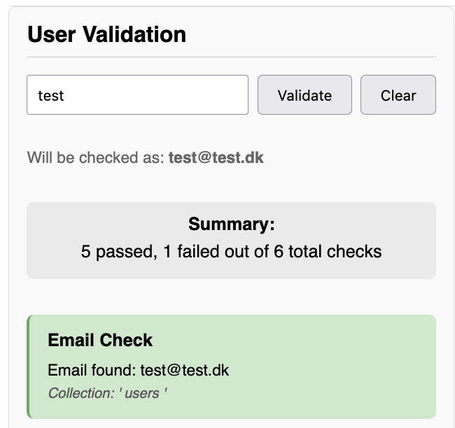
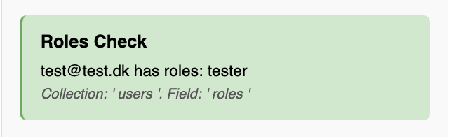
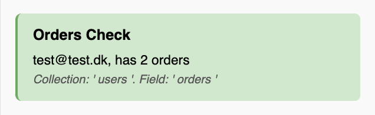
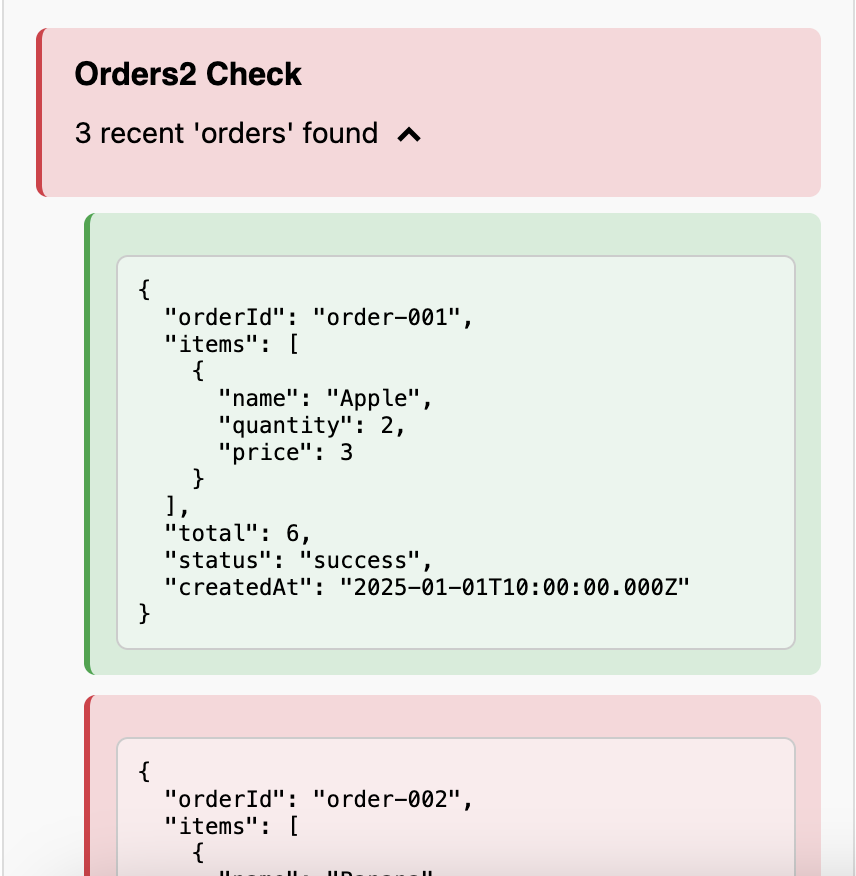
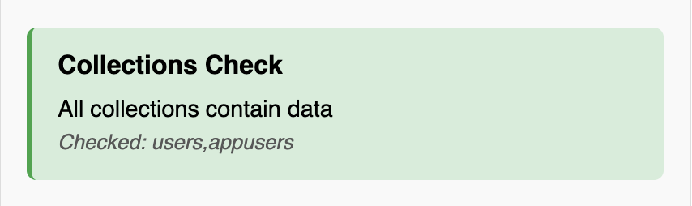
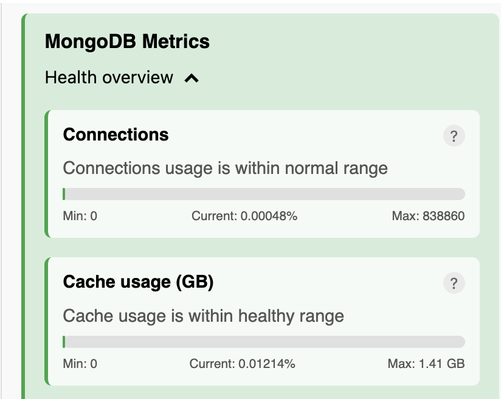
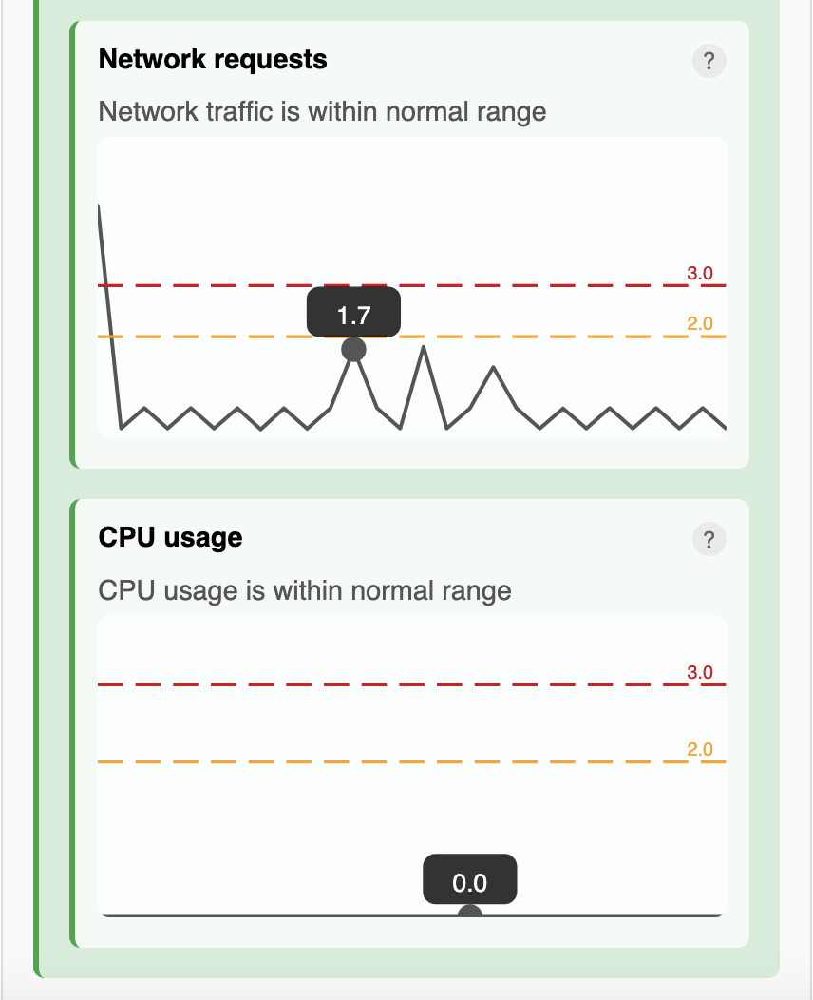
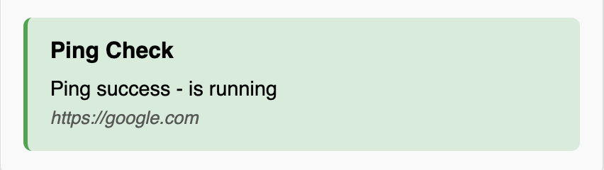
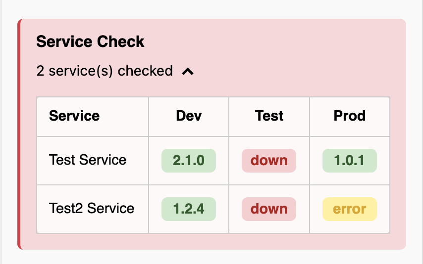

# Generic Support Tool with Couchbase or MongoDB Backend

> The purpose of this support tool is to make it reusable for different customers.
> Fork it, use it for one customer, then fork it again and use it for another.

> It works whether the customer uses MongoDB or Couchbase as the backend.

## Table of Contents

- [Run Locally](#run-locally)
- [Database](#database)
  - [Seeding](#seeding)
  - [Couchbase Indexes](#couchbase-indexes)
  - [Couchbase Error](#couchbase-error)
- [Checks](#checks)
  - [User Validations](#user-validations)
    - [Email Check](#email-check)
    - [Roles Check](#roles-check)
    - [Count Check](#count-check)
    - [Dropdown Check](#dropdown-check)
  - [DB Validations](#db-validations)
    - [Collections Check](#collections-check)
    - [Metrics Check](#metrics-check)
  - [System Validations](#system-validations)
    - [Ping Check](#ping-check)
    - [Service Check](#service-check)

## Run Locally

**BACKEND:**

> $ `node backend/app.js`

**FRONTEND:**

> $ `cd frontend`

> $ `npm run dev`

**TESTS:**

> $ `cd backend`

> $ `npm test`

## DATABASE:

**Testdatabase:**
> Docker Compose starts two containers: one with MongoDB and one with Couchbase.

> $ `docker compose up -d`

### Seeding
> To seed the testdatabase follow these steps:

> 1. Create your database with mongo or couchbase
> 2. Fill out the connections to the database in you .env-file (follow .env-example)
> 3. Start the database in the containers with:

> $ `docker compose up -d`

> 4. Now you can seed the database that you have choosen in your .env-file (DATABASE_TYPE)

> $ `cd backend`

> $ `npm run seed`

### Couchbase-indexes:

> For Couchbase to work with the support tool and the different checks, create the following index:

> "CREATE PRIMARY INDEX ON `<BUCKET>`.`<SCOPE>`.`<COLLECTION>`;"

### Couchbase error:

> If you encounter a "native-build" error when starting your Couchbase database, follow these steps:

> $ `rm -rf node_modules package-lock.json`

> $ `npm i`

## CHECKS:

> To configure the different checks, see `.env-example`.
> Note that some checks can be "multiplied" if your configuration is set correctly.

> Fx - with the count-check, you can have a check that counts 'orders' and also a count-check that counts 'products'.

> You can choose which checks you want to have in your tool, by choosing the FOO_ENABLED to be true/false (e.g. ROLES_CHECK_ENABLED=true).

### User Validations:

#### EMAIL-CHECK:

> Checking if the users email is in the choosen database.
> Configure the EMAIL_ENDING variable (e.g @test.dk) to reuse the same email domain for every user lookup.

---

#### ROLES-CHECK:

> Checking if the user has a role and displays it.

---

#### COUNT-CHECK:

> Counts how many items (e.g. "orders") the user has.
> - You can make several of these

---

#### DROPDOWN-CHECK:

> This check displays the payload for the chosen field.
> - You can make several of these

**Status:**
> If your payload contains a `status` field matching one of the values below, this will determine the item status. All other values will be treated as neutral.

| Payload status | Item Status  |
|----------------|--------------|
| 'error'        | 'fail'       |
| 'fail'         | 'fail'       |
| 'cancelled'    | 'fail'       |
|----------------|--------------|
| 'success'      | 'success'    |
| 'ok'           | 'success'    |
| 'sent'         | 'success'    |
| 'shipped'      | 'success'    |
|----------------|--------------|
| 'warning'      | 'warning'    |

---

### DB Validations:

#### COLLECTIONS-CHECK:

> Checks all collections defined in your environment variables for data.
> - If success -> shows all the collections you choose.
> - If fail -> shows all the empty collections

---

#### METRICS-CHECK:

> This check provides different metrics depending on whether MongoDB or Couchbase is used.

**MongoDB-metrics**
> - Connections
> - Chache usage
> - Network requests
> - CPU usage

**Couchbase-metrics**
> - Ram Usage in bucket
> - Connections 
> - Network

---

### System Validations:

#### PING-CHECK:

> This check pings an URL, to see if it is reachable, e.g. an SAP Identity Server.

---

#### SERVICE-CHECK:

> This check is similar to a health check, but it renders the selected services' `/version` endpoints, allowing you to see which versions are currently deployed and which aren't running.

